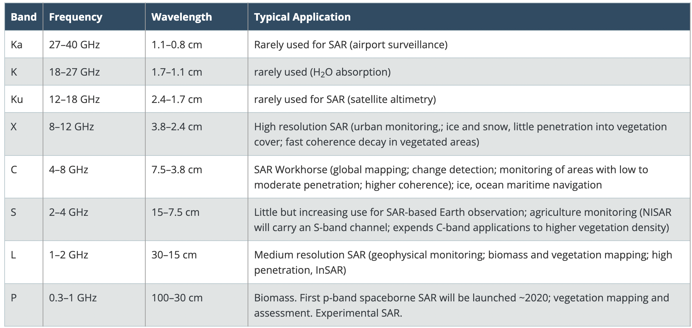
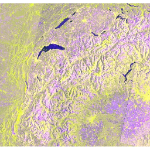
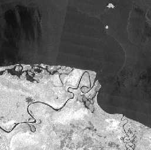
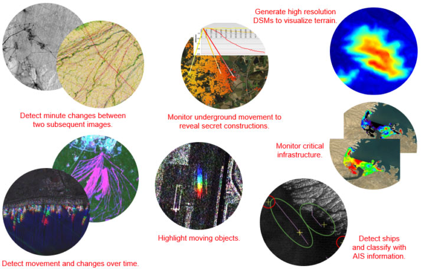

```{r xaringan-themer, include=FALSE, warning=FALSE}
library(xaringanthemer)
style_mono_accent(
  base_color = "#1381B0",
  header_font_google = google_font("Josefin Sans"),
  text_font_google   = google_font("Montserrat", "300", "300i"),
  code_font_google   = google_font("Fira Mono")
)
```

# Sensor Summary

### Synthetic Aperture Radar (SAR)
- Using radar over optical remote sensing

- **Advantanges**

> (+) Ability to capture data day or night

> (+) See through clouds

> (+) Weather independence by selecting proper frequency range

> (+) Penetration through the vegetation
canopy and the soil

- (+/-) Sensitivity to structure

- **Disadvantanges**

> (-) Information content is different than optical and sometimes difficult to interpret

- Variable resolution is 1 to 100 m
---
### SAR's Frequency and Wavelength

```{r echo=FALSE, out.width='100%', fig.align='center'}

```
---
### Available Data in Earth Engine

**Sentinel-1 SAR GRD: C-band Synthetic Aperture Radar Ground Range Detected, log scaling**

.pull-left[
```{r echo=FALSE, out.width='100%', fig.align='center'}

```
]

.pull-right[
**The Sentinel-1** mission provides data from a dual-polarization C-band Synthetic Aperture Radar (SAR) instrument at 5.405GHz (C band). The collection is **updated daily**. New assets are ingested within two days after they become available.

- Each scene has one of 3 resolutions (10, 25 or 40 meters)
- 4 band combinations (single band VV or HH, and dual band VV+VH and HH+HV
)

https://developers.google.com/earth-engine/datasets/catalog/COPERNICUS_S1_GRD
]
---
### Available Data in Earth Engine

**PALSAR-2 ScanSAR Level 2.2**

.pull-left[
```{r echo=FALSE, out.width='100%', fig.align='center'}

```
]

.pull-right[
**The 25 m PALSAR-2 ScanSAR** is normalized backscatter data of PALSAR-2 broad area observation mode with observation width of 350 km. The SAR imagery was ortho-rectificatied and slope corrected using the ALOS World 3D - 30 m (AW3D30) Digital Surface Model

https://developers.google.com/earth-engine/datasets/catalog/JAXA_ALOS_PALSAR-2_Level2_2_ScanSAR
]
---
# SAR Applications

```{r echo=FALSE, out.width='80%', fig.align='center'}

```
---

# Reflection

Data generated by SAR are so useful, especially when using to gather data in some area covered with cloud. Although, it can be corrected by using data from the other timeframe, we may want to look what happens at the specific time that are full of clouds. Therefore, SAR with its feature to be able to see through clouds is quite useful in this case. Moreover, the frequency of data is also high.

---

# References
- https://www.l3harrisgeospatial.com/Learn/Blogs/Blog-Details/ArtMID/10198/ArticleID/24031/Enhancing-Situational-Awareness-with-SAR

- https://www.earthdata.nasa.gov/learn/backgrounders/what-is-sar

