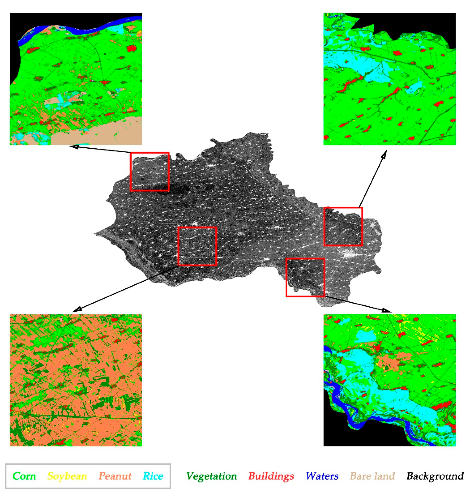

```{r xaringan-themer, include=FALSE, warning=FALSE}
library(xaringanthemer)
style_mono_accent(
  base_color = "#1381B0",
  header_font_google = google_font("Josefin Sans"),
  text_font_google   = google_font("Montserrat", "300", "300i"),
  code_font_google   = google_font("Fira Mono")
)
```

# Sensor Summary

### Synthetic Aperture Radar (SAR)
- Using radar over optical remote sensing

- **Advantanges**

> (+) Ability to capture data day or night

> (+) See through clouds

> (+) Weather independence by selecting proper frequency range

> (+) Penetration through the vegetation
canopy and the soil

- (+/-) Sensitivity to structure

- **Disadvantanges**

> (-) Information content is different than optical and sometimes difficult to interpret

- Variable resolution is 1 to 100 m
---

### SAR's Frequency and Wavelength

```{r echo=FALSE, out.width='100%', fig.align='center'}
knitr::include_graphics("images/SAR_bands.png")
```
---

### Available Data in Earth Engine

**Sentinel-1 SAR GRD: C-band Synthetic Aperture Radar Ground Range Detected, log scaling**

.pull-left[
```{r echo=FALSE, out.width='100%', fig.align='center'}
knitr::include_graphics("images/COPERNICUS_S1_GRD_sample.png")
```
]

.pull-right[
**The Sentinel-1** mission provides data from a dual-polarization C-band Synthetic Aperture Radar (SAR) instrument at 5.405GHz (C band). The collection is **updated daily**. New assets are ingested within two days after they become available.

- Each scene has one of 3 resolutions (10, 25 or 40 meters)
- 4 band combinations (single band VV or HH, and dual band VV+VH and HH+HV
)

[Source: GEE](https://developers.google.com/earth-engine/datasets/catalog/COPERNICUS_S1_GRD)
]
---

### Available Data in Earth Engine

**PALSAR-2 ScanSAR Level 2.2**

.pull-left[
```{r echo=FALSE, out.width='100%', fig.align='center'}
knitr::include_graphics("images/JAXA_ALOS_PALSAR-2_Level2_2_ScanSAR_sample.png")
```
]

.pull-right[
**The 25 m PALSAR-2 ScanSAR** is normalized backscatter data of PALSAR-2 broad area observation mode with observation width of 350 km. The SAR imagery was ortho-rectificatied and slope corrected using the ALOS World 3D - 30 m (AW3D30) Digital Surface Model

[Source: GEE](https://developers.google.com/earth-engine/datasets/catalog/JAXA_ALOS_PALSAR-2_Level2_2_ScanSAR)
]
---

# SAR Applications
There are many applications using SAR data
```{r echo=FALSE, out.width='80%', fig.align='center'}
knitr::include_graphics("images/4-21_AustrailianSAR_BlogPic1.jpeg")
```
[Source: Cherie Muleh 2021](https://www.l3harrisgeospatial.com/Learn/Blogs/Blog-Details/ArtMID/10198/ArticleID/24031/Enhancing-Situational-Awareness-with-SAR)
---

# SAR Applications
**Multi-Temporal SAR Data Large-Scale Crop Mapping Based on U-Net Model**
```{css echo=FALSE}
.left-column {
  float: left;
  width: 30%;
}
.right-column {
  float: right;
  width: 70%;
}
.small-font {
    font-size: 18px;
    padding: 0em 0em 0em 0em;
}
```
.left-column[
```{r echo=FALSE, out.width='70%', fig.align='center'}

```
Source: [Sisi Wei 2019](https://www.mdpi.com/2072-4292/11/1/68)
]

.small-font[
This study presents a large-scale multispecies crop classification in Jilin, China. All of the pixels in SAR data were classified into four crops (including corn, peanut, soybeans, and rice,) and 4 non-crops (buildings, vegetation, water, and bare land). It achieved an overall accuracy of 85% as well as a Kappa coefficient of 0.82.
+ **Input**
  + Data: multi-temporal Sentinel-1 data (including dual-polarization SAR)
+ **Methodology**: Classification models were built classify 4 types of crops and also 4 types of non-crops by using convolutional neural network based architecture, such as U-Net and fully convolutional network (FCN).
+ **Comments**: It is good to see the researchers applying complex models such as deep learning models with the remote sensing data. Further improvement may include trying combining spectral data with SAR data. It is expected to improve the accuracy more or less. This is the reference for supporting this idea [Yinghui Quan 2020](https://www.mdpi.com/2072-4292/12/22/3801)
]

---

# Reflection

**Content**: Data generated by SAR are very useful, especially when using to gather data in some area covered with cloud. Although, it can be corrected by using data from the other timeframe, we may want to look what happens at the specific time that are full of clouds. Therefore, SAR with its feature to be able to see through clouds is quite useful in this case. Moreover, the frequency of data is also high. Moreover, I found that there are many data available in Google Earth Engine data catalog. This will be very useful for many researchers.

**Application**: As a computer science student, I am very happy to see how we can apply machine learning and deep learning methods with the applications in geography, environment and remote sensing. Recently, there are many more advanced models and architecture updating in every year. I would like to know more if the new advanced models can be applied and produced the useful outcomes or insight to the remote sensing field.

---

# References

- Enhancing Situational Awareness with SAR Data (no date) L3Harris Geospatial. Available at: [https://www.l3harrisgeospatial.com/Learn/Blogs/Blog-Details/ArtMID/10198/ArticleID/24031/Enhancing-Situational-Awareness-with-SAR](https://www.l3harrisgeospatial.com/Learn/Blogs/Blog-Details/ArtMID/10198/ArticleID/24031/Enhancing-Situational-Awareness-with-SAR) (Accessed: 2 February 2023).

- Earth Science Data Systems, N. (2020) What is Synthetic Aperture Radar?, Earthdata. Earth Science Data Systems, NASA. Available at: [https://www.earthdata.nasa.gov/learn/backgrounders/what-is-sar](https://www.earthdata.nasa.gov/learn/backgrounders/what-is-sar) (Accessed: 2 February 2023).
